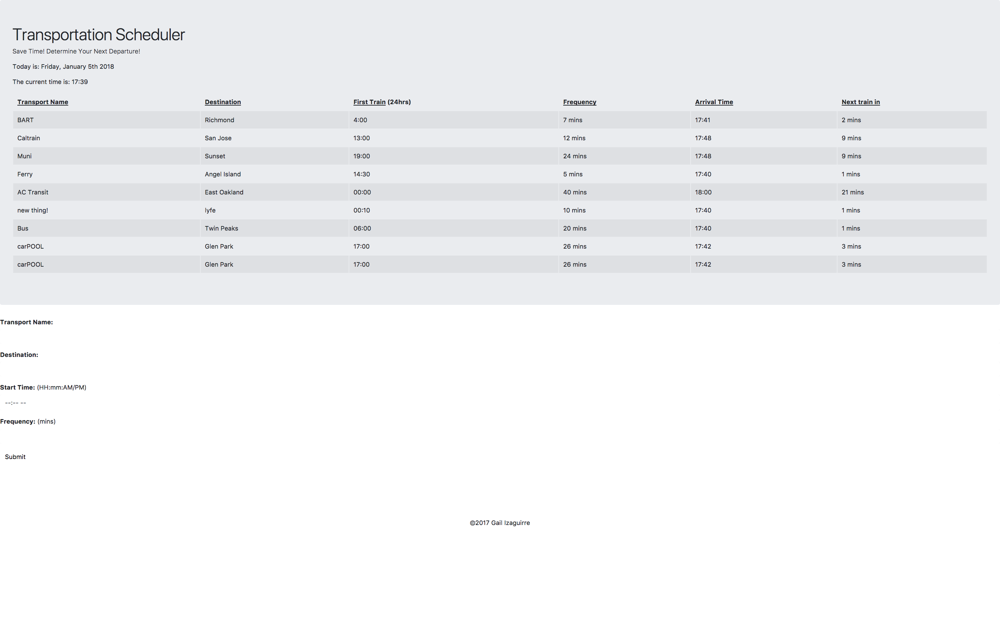

# TrainTime: Trasnportation Scheduler
Using Moment.JS, this application calculates the estimated arrival time of the transportation mode of your choice.  The application retrieves the current time and produces an expected time of arrival based on your input.  The data is stored in Firebase for easy retrieval.  

## Instructions

  * Input the information in the fields to determine when the next "train" (mode of transportation) will arrive.

  * See how many minutes left for the next ride.

## Methodology
  1. The Shell: basic html, bootstrap for design, set up github repo, add links to libraries.

  2. Set up Firebase database

  3. Javascript
        *  Firebase configuration & initialize.
        *  Global Variables.
        *  Capture information entered at button click.
        *  Push information to firebase.
        *  Clear the input form after push.
        *  "Child Added" to keep all the new information instead of replacing.
        *  Calculations using moment.js.
        *  Update the html.

**Thank you for your Attention!**

Gail Izaguirre (C) 2017.  All Rights Reserved.
